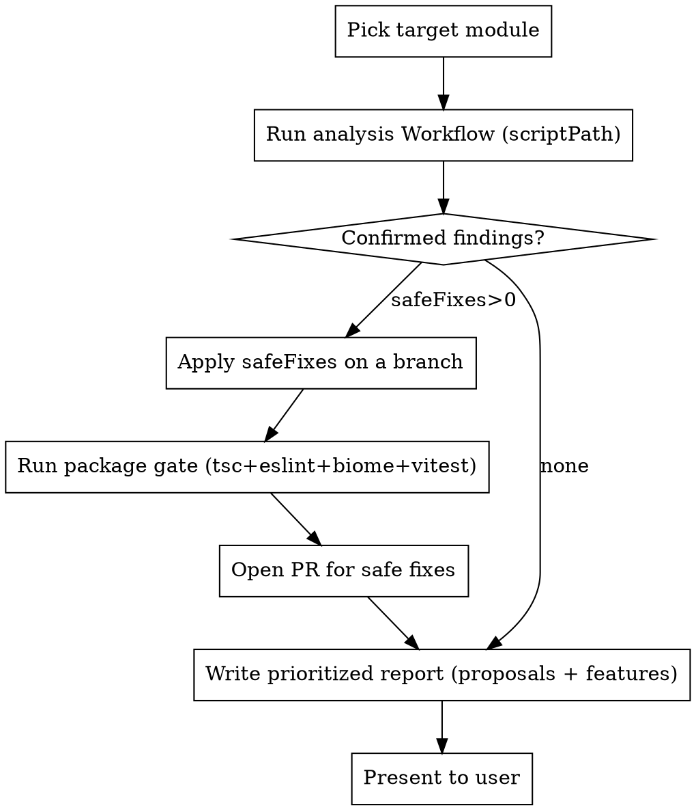

# Continuous Improvement

## Overview

A module-by-module improvement engine. It runs an **analysis Workflow** (read-only, multi-agent fan-out) over one target module, then YOU apply the safe fixes as a PR and surface the rest as a report. Risky writes stay in the main loop, behind the user's push-gate.

**Core principle:** Parallel agents find & adversarially verify; the main loop decides and writes. Never auto-push behavior changes — only mechanical safe fixes go to a PR, everything else is a proposal.

## NON-NEGOTIABLE: obey `CODING_CONVENTIONS.md`

Before applying ANY fix, read `CODING_CONVENTIONS.md` at the repo root. Every change this skill writes MUST satisfy it: HEXA/DDD/SOLID layering, **OOP only — never `export function`/`export const = () =>`**, no useless comments, and the package gate (tsc + eslint + biome + vitest) must stay green. A fix that breaks any convention is rejected, not applied.

## The 8 axes + features

CI compliance · architecture/SOLID · performance · code quality · security · bug review · useless comments · doc drift — plus grounded feature proposals.

## Scope: one module per run

Target one module path at a time (e.g. `core/src/modules/raffle`). Whole-repo-per-run is too noisy and token-heavy; rotate modules across runs. The list of `core/src/modules/*` directories is the rotation set.

## Workflow

## Steps

1. **Pick the target.** Use the `$ARGUMENTS`/explicit module if given, else the next module in rotation (a module not touched by a recent improvement branch).
2. **Run the engine.** Call the Workflow tool with `scriptPath` pointing at `continuous-improvement.workflow.js` (next to this file) and `args: { target: "<module path>" }`. It returns `{ counts, safeFixes, proposals, features }`.
3. **Apply safe fixes.** Create a branch `improve/<module>-<short>`. Apply ONLY `safeFixes` (dead comments, lint/format, doc text, trivial type tightening). Never touch behavior here.
4. **Gate.** From the package dir (e.g. `core/`) run `/usr/bin/npx tsc --noEmit && eslint . && @biomejs/biome check . && vitest run`. Must be green before the PR.
5. **PR.** Push the branch and `gh pr create` with the safe fixes. (Pushing is user-gated — if denied, keep the branch local and say so.)
6. **Report.** Write a prioritized markdown report of `proposals` (by severity) + `features` to `docs/improvement/<date>-<module>.md` and summarize inline.

## Triggers (all three supported)

- **On-demand:** `/improve <module>` (project command) — one pass on one module.
- **Autonomous loop:** `/loop améliore le projet module par module` — pace passes via ScheduleWakeup, advancing the rotation each wake.
- **Scheduled:** a cron (CronCreate) that fires the on-demand pass on a rotating module daily/weekly and leaves a report.

## Common mistakes

- **Auto-applying non-safe findings.** Only `safeFixes` get written. Architecture/perf/security/bug findings are PROPOSALS — never silently changed.
- **Skipping the gate before the PR.** Always run the full package gate; a red PR is a failure.
- **Pushing without a gate.** Pushes are user-gated; if denied, keep the branch local and report it.
- **Whole-repo in one run.** Too noisy/expensive — one module per run, rotate.
- **Trusting unverified findings.** The engine already adversarially verifies; still sanity-check any fix you apply against the real code.
